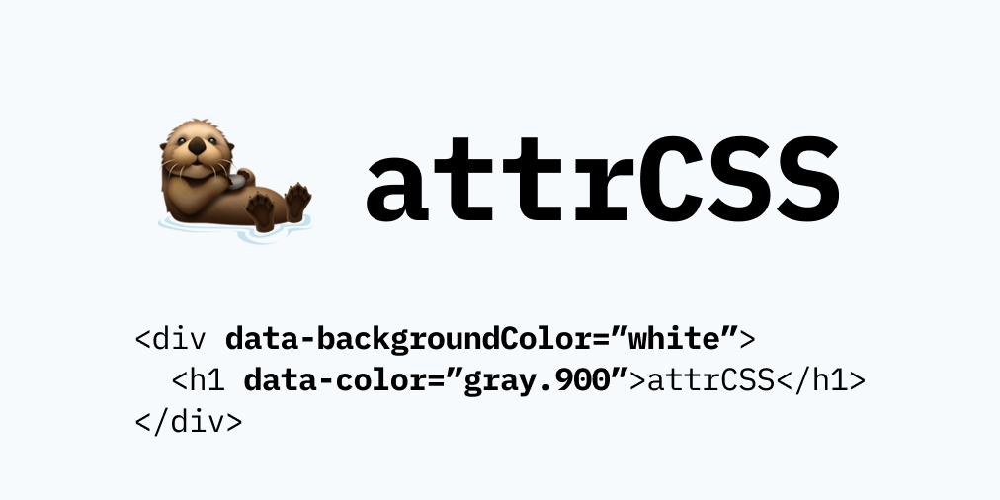

<br />

<p align="center">
    
</p>

<h1 align="center">TailwindCSS using data attributes</h1>

```html
<div data-backgroundColor="white">
  <h1 data-color="gray.900">attrCSS</h1>
</div>
```

## Usage

This command generates an `attr.css` file that can be used in your project:

```shell
npx attrcss build
```

Import the generated CSS file in your project, and start using data attributes:

```html
<div data-backgroundColor="white">
  <h1 data-color="gray.900">attrCSS</h1>
</div>
```

## Install

```shell
# yarn
yarn add -D attrcss

# npm
npm i -D attrcss
```

Then run it using `attrcss build`.

## Options

### `-i`, `--input`

Specify a custom `.json` theme file. Your theme will be merged with the default one.

It must follow this structure:

```json
{
  "prefix": "",
  "separator": ".",
  "theme": {
    "something": {
      "extend": ["colors", "spacing", "-spacing"],
      "alias": ["someone"],
      "valueName1": "value",
      "valueName2": "value"
    }
  },
  "variants": {}
}
```

- **prefix:** inserted after `data-`
- **separator:** used for nested values, like `gray.900`
- **something:** a valid css property. Use either kebab case or camel case
- **extend:** automatically extends this property with theme colors or spacing. `"-spacing"` results in negative values.
- **alias:** alternative name for `something`. Will be used for creating data properties.
- **valueName:** possible values.
- **variants:** can be `responsive` or any other CSS pseudo class.

### `-o`, `--output`

You can specify a custom output file here. It must be a CSS file.

---

PS. **Use PurgeCSS!**

PPS. This is functional, but I never tried it in production. 🦦

PPPS. The code is a bit messy. I was kinda bored .\_.
